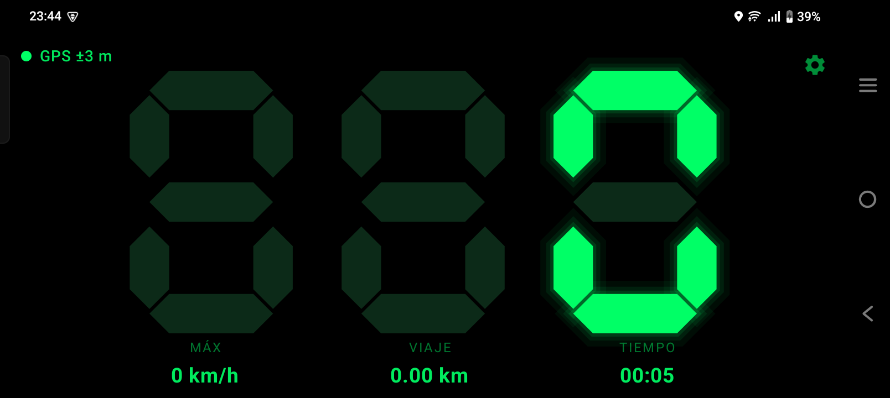
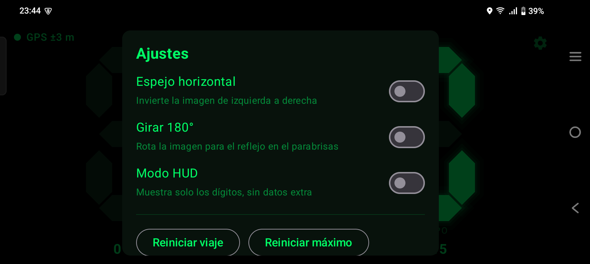
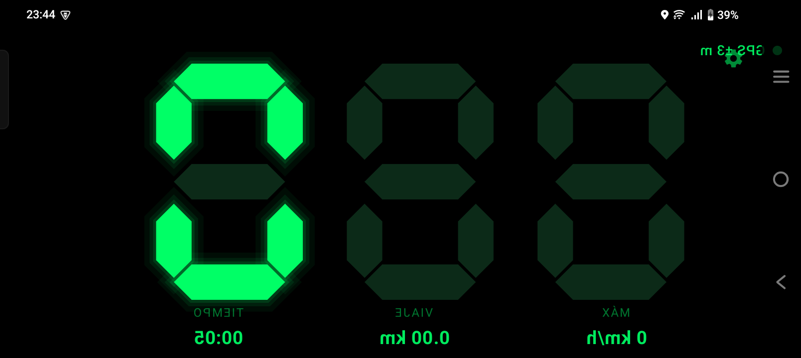

# Velocímetro 7 Seg

Velocímetro GPS para Android con display de **7 segmentos** verde, pensado para
usarse como tablero dentro del auto.


---

## Características

- **Display de 7 segmentos** dibujado a medida, con glow verde y segmentos
  apagados apenas visibles, como un velocímetro digital real.
- **Velocidad por GPS** (sin hardware adicional), suavizada para que el número
  no tiemble.
- **3 dígitos, sin decimales**, de 0 a 999 km/h, con apagado de ceros a la
  izquierda.
- **Velocidad máxima** registrada en la sesión, con reset.
- **Odómetro de viaje** (distancia recorrida) y **tiempo de viaje**.
- **Indicador de señal GPS** con la precisión estimada en metros.
- **Modo HUD**: espejo horizontal y/o rotación 180° para reflejar la imagen en
  el parabrisas.
- **Pantalla siempre encendida** y **orientación horizontal** forzada.
- **Todo se guarda localmente**. La app no tiene permisos de internet ni envía
  datos a ningún lado.

---

## Capturas

| Vista normal | Ajustes | Modo HUD (espejo) |
|:---:|:---:|:---:|
|  |  |  |

---

## Requisitos

| | |
|---|---|
| Android | 8.0 (API 26) o superior |
| GPS | Receptor GPS (cualquier teléfono) |
| Compilar | JDK 17+ y el Android SDK con API 35 |

La app **no** funciona en el emulador sin una ubicación simulada, porque
necesita un receptor GPS real para medir velocidad.

---

## Instalación

### Opción A: APK ya compilado

1. Descargá el APK de la sección [Releases](../../releases)
   (por ejemplo `velocimetro-7seg-1.0.0.apk`).
2. Copialo al teléfono e instalalo (hay que permitir "instalar apps de
   orígenes desconocidos").

### Opción B: compilar desde el código

```bash
git clone https://github.com/japentaca/velocimetro-7seg.git
cd velocimetro-7seg
```

En Windows (PowerShell), respetando las reglas de `AGENTS.md` para no colgar la
consola con el daemon de Gradle:

```powershell
$p = Start-Process -FilePath ".\gradlew.bat" -ArgumentList ":app:assembleDebug","--console=plain" `
     -RedirectStandardOutput out.log -RedirectStandardError err.log -NoNewWindow -PassThru
$p | Wait-Process -Timeout 900 -ErrorAction SilentlyContinue
if (-not $p.HasExited) { $p.Kill(); "TIMEOUT" } else { "ExitCode=$($p.ExitCode)" }
Get-Content err.log -Tail 30
```

En Linux/macOS:

```bash
./gradlew :app:assembleDebug --console=plain
```

El APK queda en `app/build/outputs/apk/debug/app-debug.apk`.

Para instalarlo por ADB:

```bash
adb install -r app/build/outputs/apk/debug/app-debug.apk
```

> **Importante (Windows):** `gradlew` y `adb` lanzan daemons que heredan los
> handles de stdout/stderr. Si los invocás con la salida conectada a la consola,
> la sesión queda esperando para siempre aunque el comando ya terminó. Usá
> siempre redirección a archivo, como en el ejemplo de arriba.

---

## Uso

1. Al abrir la app, **concedé el permiso de ubicación**. Sin él no se puede leer
   la velocidad.
2. Apoyá el teléfono en el tablero en horizontal.
3. Esperá a que el indicador pase a verde (`GPS ±N m`). Un valor de precisión
   bajo (≤ 12 m) significa que la lectura es confiable.
4. Empezá a manejar. El número grande es la velocidad actual en km/h.

### Indicador de señal

| Color | Significado |
|---|---|
| Verde | Precisión ≤ 12 m — lectura confiable |
| Ámbar | Precisión ≤ 30 m — usable, algo de ruido |
| Rojo | Sin fix o precisión > 30 m — dato no confiable |

### Ajustes

Tocá el **engranaje** (arriba a la derecha; siempre está en el mismo lugar, no
se invierte). El panel permite:

- **Espejo horizontal** — invierte la imagen de izquierda a derecha.
- **Girar 180°** — rota la imagen.
- **Modo HUD** — muestra solo los dígitos, sin datos extra.
- **Reiniciar viaje** / **Reiniciar máximo**.

Los cambios se aplican al instante y quedan guardados para el próximo arranque.

### Modo HUD (reflejo en el parabrisas)

Apoyá el teléfono **boca arriba** sobre el tablero, con la pantalla apuntando
hacia el parabrisas. El reflejo que ve el conductor es una imagen invertida; la
combinación de ajustes que la corrige depende de cómo quede orientado el
teléfono:

| Espejo | Girar 180° | Resultado |
|:---:|:---:|---|
| ✗ | ✗ | Normal (sin inversión) |
| ✓ | ✗ | Espejo izquierda ↔ derecha |
| ✗ | ✓ | Rotado 180° |
| ✓ | ✓ | Invertido arriba ↔ abajo |

Probá en el auto y dejá la combinación que se vea correcta en el parabrisas.
Con **Modo HUD** activado solo quedan los dígitos, que es lo que conviene para
el reflejo.

---

## Cómo funciona

### Lectura de velocidad

Se usa `FusedLocationProviderClient` de Google Play Services con
`PRIORITY_HIGH_ACCURACY` y una actualización cada 1 s (mínimo 500 ms). La
velocidad instantánea que reporta el GPS viene en m/s y se convierte a km/h.

Para que el número no tiemble se aplican tres filtros en
`SpeedViewModel.kt`:

1. **Deadband**: por debajo de 2 km/h se considera 0, para que el auto detenido
   no muestre ruido.
2. **Media exponencial**: `nueva = anterior × 0,55 + instantánea × 0,45`.
3. **Umbral de corte**: por debajo de 1 km/h vuelve a 0.

### Odómetro

La distancia se integra con la velocidad suavizada (`v × dt`), usando las marcas
de tiempo de las muestras GPS. El `dt` se limita a 5 s para que un bache en la
señal no sume distancia falsa. Si el GPS no reporta velocidad, se usa la
distancia directa entre puntos. Las muestras con precisión peor a 40 m se
descartan.

### Dibujo de los 7 segmentos

Cada dígito se dibuja como 7 polígonos con los extremos biselados (segmentos
`a`–`g`), y se encienden según una máscara de bits por dígito. Los segmentos
apagados se pintan en un verde muy oscuro para dar el look de LED real. El glow
se logra con tres pasadas de `Stroke` de ancho decreciente y baja opacidad
alrededor de cada segmento encendido — se evita `BlurMaskFilter` porque no está
soportado de forma confiable con aceleración por hardware.

---

## Estructura del proyecto

```
app/src/main/java/com/velocimetro/seg7/
├── MainActivity.kt        Activity, permiso de ubicación y gate de permisos
├── SpeedViewModel.kt      GPS, suavizado, odómetro, máximo y tiempo
├── SettingsStore.kt       Persistencia de ajustes (SharedPreferences)
└── ui/
    ├── Seg7.kt            Composable de dibujo de los 7 segmentos
    ├── SpeedScreen.kt     Pantalla principal, panel de ajustes y modo HUD
    └── Theme.kt           Tema Material 3 en negro/verde
```

---

## Permisos

| Permiso | Para qué |
|---|---|
| `ACCESS_FINE_LOCATION` | Leer la velocidad del GPS |
| `ACCESS_COARSE_LOCATION` | Respaldo si el usuario deniega el preciso |

La app **no** declara `INTERNET`, así que técnicamente no puede enviar datos
afuera. La ubicación se usa solo en el dispositivo y no se guarda ni se
comparte.

---

## Precisión y limitaciones

- La velocidad depende de la calidad de la señal GPS. Bajo techo, en túneles,
  entre edificios altos o con el teléfono en la guantera, la lectura puede
  degradarse o perderse.
- El GPS reporta velocidad con un retardo de hasta ~1 s y suele marcar unos
  pocos km/h de más en pendientes pronunciadas.
- El odómetro es una estimación por integración de velocidad; no reemplaza al
  del auto.
- La velocidad máxima se calcula con la velocidad suavizada, así que un pico
  muy breve puede quedar levemente atenuado.

---

## Contribuir

Las contribuciones son bienvenidas. Leé [`CONTRIBUTING.md`](CONTRIBUTING.md)
antes de abrir un issue o un pull request.

## Código de conducta

Este proyecto se rige por el [`CODE_OF_CONDUCT.md`](CODE_OF_CONDUCT.md).

## Seguridad

Para reportar una vulnerabilidad, seguí lo indicado en
[`SECURITY.md`](SECURITY.md).

## Cambios

Ver [`CHANGELOG.md`](CHANGELOG.md).

## Licencia

Distribuido bajo la licencia MIT. Ver [`LICENSE`](LICENSE).

Copyright © 2026 Javier Ntaca
